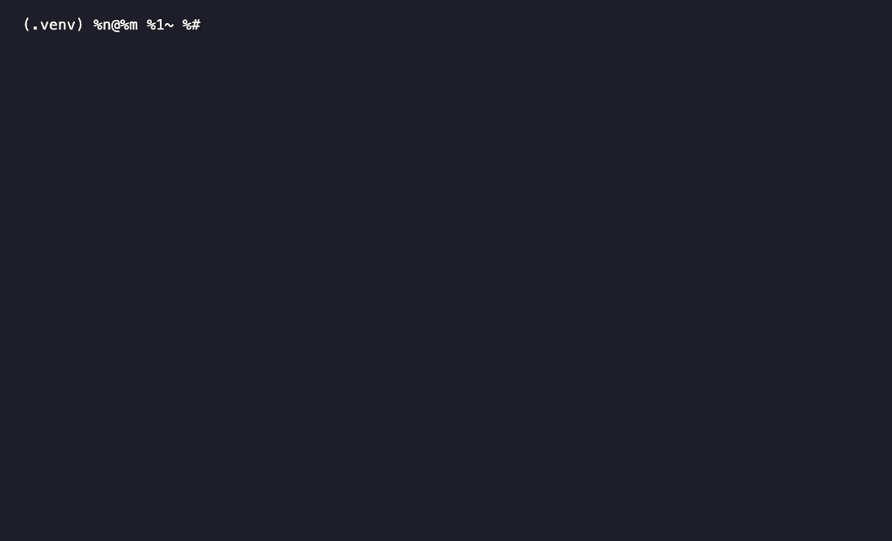

# LogLens

**See what changed in your logs across a deploy — locally, in one command, explained by AI.**

LogLens diffs two logs (before and after a deploy or incident) and ranks what's **new**,
**spiking**, or **vanished** — pulling the errors a change introduced out of the routine noise.
It mines raw lines into templates and scores each by statistical surprise, so detection is
deterministic and runs entirely on your machine. An optional stage sends a tiny digest — never
your raw logs — to OpenAI for a plain-English explanation.



> **Core thesis:** *statistics detect, the LLM explains.* The statistical layer is cheap,
> local, and reproducible; the LLM only ever sees a ~2 KB digest of the top anomalies.

## Highlights

- **Deploy diff** — `loglens diff before.log after.log` ranks what changed, in seconds.
- **Auto-format** — JSON, logfmt, nginx/Apache, syslog, ISO-8601 app logs; gzip and stdin too.
- **Evaluated** — **0.85 F1** (unsupervised) on the HDFS_v1 anomaly-detection benchmark.
- **Private, optional AI** — raw logs stay local; `--explain` is opt-in and sees only a digest.
- **Zero infrastructure** — a `pip install`; no collectors, storage, or dashboards.

See [`docs/DESIGN.md`](docs/DESIGN.md) for the full design, decisions, and milestones.

## How it works

```
source ──► ingest ──► template mining ──► scoring ──► digest ──► report
 (file)    (LogRecord   (Drain3:            (baseline vs         (terminal/JSON)
            stream)      lines→templates)    window, Poisson         │
                                             surprise)               ▼
                                                          [optional] LLM summary
                                                          (~2KB digest in, never raw logs)
```

Template mining collapses millions of raw lines into a few hundred templates. Frequency
statistics over those templates find anomalies cheaply and deterministically. Each candidate
is scored by **Poisson surprise** — how improbable its window count is given its baseline rate —
so a rare-but-new error outranks a common template that merely got a bit louder.

## Why Poisson, concretely

On the HDFS 2k sample with a 25-line error burst injected into the window:

| Ranking method | Where the burst lands |
|---|---|
| Raw count delta | #4 — misses it (common templates' normal wobble outranks a real burst) |
| **Poisson surprise** | **#1, score 75.8** (next item: 7.6) |

That gap is the whole point of the project.

## Development

Requires Python ≥ 3.10.

```bash
git clone https://github.com/tpatil17/log-lens
cd log-lens
python3 -m venv .venv && source .venv/bin/activate
pip install -e ".[dev]"
```

Run the test suite (includes the A4 acceptance test) and the linter:

```bash
make test    # pytest
make lint    # ruff
```

## Install

```bash
pipx install loglens          # recommended (once published to PyPI)
pip install loglens           # or into your environment
pip install "loglens[llm]"    # add the optional OpenAI --explain support
```

Or run it without a local Python setup, via Docker:

```bash
docker build -t loglens .
docker run --rm -v "$PWD:/logs" loglens diff /logs/before.log /logs/after.log
```

## Usage

```bash
loglens diff before.log after.log  # what changed across a deploy/incident (the flagship)
loglens diff before.log after.log --explain   # + plain-English explanation (OpenAI)
loglens analyze app.log            # split one file at its midpoint and rank changes
loglens inspect app.log            # detect format + preview (before analyzing)
loglens watch app.log              # tail live; alert on anomalies vs launch baseline
```

The headline use case is **diffing a log across a deploy**: point `diff` at a
pre-deploy capture and a post-deploy capture, and it ranks what's newly appearing,
spiking, or gone — the errors a deploy introduced, surfaced out of the routine
noise. `--explain` and `--json` work on `diff` too.

All commands auto-detect the log format — JSON, logfmt, nginx/Apache access,
syslog, and ISO-8601 timestamped app logs — and handle gzip and stdin and fold
multiline stack traces. `inspect` reports which format it detected.

`--explain` is opt-in (tokens are spent only when you ask). It sends a compact
~1–2 KB digest of the *top anomalies only* — never your raw logs — to OpenAI, and
the model is constrained to explain that digest and label causes as hypotheses.
Needs `OPENAI_API_KEY`; without it the report prints as normal and the step is
skipped.

## Configuration (API key)

The LLM step (`--explain`) uses **your own** OpenAI key, supplied at runtime.
LogLens never ships, stores, or proxies a key — it calls OpenAI directly from your
machine, so the key never leaves your control. Everything except `--explain` runs
fully offline and needs no key.

Provide the key in whichever way suits you:

```bash
# a) environment variable (current shell)
export OPENAI_API_KEY="sk-..."

# b) a .env file in the project root (auto-loaded; gitignored)
cp .env.example .env    # then edit in your key

# c) inline for one run
OPENAI_API_KEY="sk-..." loglens analyze app.log --explain
```

Rules of thumb: never pass the key as a CLI flag (it leaks into shell history),
never commit `.env`, and rotate the key in the OpenAI dashboard if it's ever
exposed. In Docker, pass it at run time (`-e OPENAI_API_KEY=...` or
`--env-file .env`) — never bake it into the image.

## Evaluation

Two evaluations share one precision/recall/F1 core (`loglens.eval`):

**Injection eval** — needs no external data, so it runs in CI. It injects
synthetic bursts of varying size and reports detection rank:

```
$ make eval
 size   rank   detected@3
    3      3   True
    5      1   True
   10      1   True
   40      1   True
```

So the detector reliably surfaces bursts of ≥5 at rank #1, and even a burst of 3
lands in the top 3.

**Block-level eval** — against the real HDFS_v1 labels (575,061 blocks, 16,838
anomalies). Each block is scored by the surprise of its rarest present event type
(`-log P(template present)` — the same "surprise vs baseline" idea, using template
*presence* as the observable), then compared to the ground-truth labels:

| metric | score |
|---|---|
| precision | 0.87 |
| recall | 0.83 |
| **F1** | **0.85** |

An unsupervised, untrained detector reaching 0.85 F1 on the standard HDFS
benchmark. Reproduce from loghub's precomputed occurrence matrix:

```bash
make eval-matrix MATRIX=data/HDFS_v1/preprocessed/Event_occurrence_matrix.csv
```

(Full labeled HDFS_v1 supplied locally; the ~1.5 GB dataset isn't committed.)

## Project layout

```
src/loglens/
  models.py      # LogRecord — the universal typed contract between stages
  sources.py     # open_lines(): file / stdin / gzip → lines (streaming)
  multiline.py   # merge(): fold stack traces into one logical record
  parsers.py     # JSON / logfmt / plaintext parsers (uniform interface)
  detect.py      # sniff-and-vote format detection
  ingest.py      # read(): auto-detect + parse → Iterator[LogRecord]
  mining.py      # mine(): records → (record, template_id) via Drain3 + masking
  scoring.py     # poisson_surprise(): the statistical surprise metric
  windowing.py   # diff() / score_counts(): baseline vs window → ranked list[Anomaly]
  pipeline.py    # analyze_file() / diff_files(): whole-file glue (ingest→mine→score)
  watch.py       # live tailing: freeze baseline at launch, alert on the window
  digest.py      # compress top-k anomalies → compact structured digest
  summarize.py   # digest → OpenAI → English explanation (optional)
  eval.py        # precision/recall harness (injection + block-level)
  cli.py         # loglens analyze / inspect (thin typer/rich adapters)
  drain3.ini     # Drain3 masking config (block IDs, etc.)
tests/           # unit + acceptance tests, HDFS_2k sample data
docs/DESIGN.md   # full design document, decisions, milestones, status
```

## Roadmap

Done: end-to-end pipeline, Poisson scoring, `analyze`/`inspect` CLI, multi-format
ingest, unit + acceptance tests with CI, the evaluation harness (HDFS F1 0.85), and
the optional LLM explanation layer (`--explain`). Next:

1. **Lower-tail scoring** so vanished logs can rank (currently one-sided).
2. **Packaging** — PyPI, Docker, a `watch` mode, demo GIF.

## License

MIT
